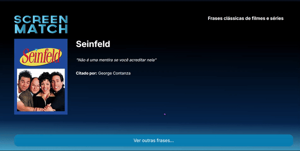

  
  
<h5 align="center"> 
    <b>✅ Completo</b> | <b>✅ Responsivo </b>
</h5>
    

O **Random Pharses** é um projeto front-end de uma aplicação que exibe frases aleatórias de filmes e séries. Com um design moderno e interativo, ele permite explorar e compartilhar citações icônicas armazenadas em um banco de dados.

  
## Demonstração
  
  

  
  

## 🛠️ Tecnologias Utilizadas

- **HTML5**  
  Estruturação semântica da aplicação.

- **CSS3**  
  Estilização com classes modulares e integração de fontes do Google Fonts.  
  Arquivos CSS utilizados:
  - `css/styles.css`: Estilos globais.
  - `css/home.css`: Estilos específicos para a página inicial.

- **JavaScript (ES6)**  
  Utilização de módulos para interatividade e manipulação de DOM.  
  Arquivo principal: `scripts/index.js`.

- **Banco de Dados (exemplo)**  
  - **Postgresql**: Armazenamento de frases e metadados (autor, filme, gênero, etc.).
  - **API** para buscar e exibir frases aleatórias do banco de dados.

- **Google Fonts**  
  Fontes utilizadas:
  - `Inter` para textos.
  - `Material Symbols Outlined` para ícones.

---

## 🎨 Design

### **Fontes e Ícones**
- **Fonte principal**: Inter (Google Fonts).  
- **Ícones**: Material Symbols Outlined.

### Cores (exemplo no CSS)
- Paleta moderna e amigável para leitura em telas.

## 👩🏻‍💻 Autor  

<table>
  <tr>
    <td align="center">
      <a href="https://github.com/robsonlmds">
         
        
          <b>Robson Lucas Messias</b>
        
      </a>
    </td>
  </tr>
</table>

 
<h4 align="center">
  Made by: Robson Lucas Messias | <a href="mailto:robsonlmds@hotmail.com">Contato</a>
</h4>

  

<h1 align="center">

</h1>
